# 2026 닷넷 개발자 데스크톱 개발

## 2.Unity 실습

### 2-1. 유니티 학습

- https://learn.unity.com/ 튜토리얼대로 따라하기
- Keijiro Takahasi Github : https://github.com/keijiro
- 이전 버전 https://unity.com/kr/releases/editor/archive 확인 다운로드 설치

#### Get Started With Unity

- Tutorial 순서대로 따라하기

    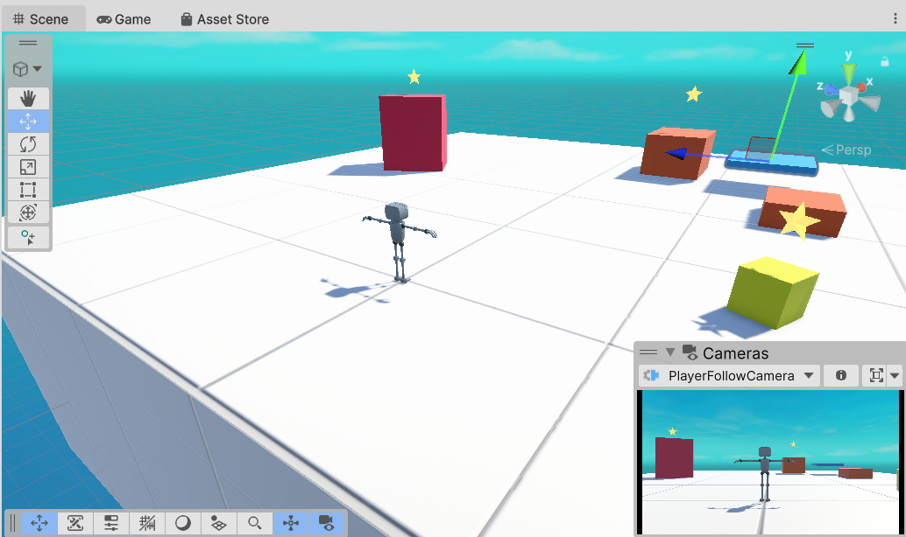

- 1번 챕터 완료 후

    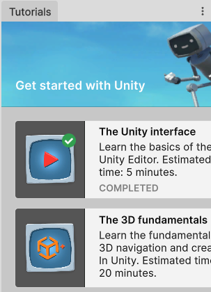

### 2-2. Essential PathWay

- 가장 짧은 시간에 Unity 학습할 수 있는 튜토리얼

#### Essentials PathWay Template

- 템플릿 다운로드 우선

- 프로젝트명, 프로젝트 위치 선택 후 프로젝트 생성

#### 화면/시점 이동

- 방향키, WSAD
- Mouse Right, Wheel Up Down
- Flythrough Mode : Mouse Right + WSAD / EQ

- Object 선택 후 F 클릭(또는 오브젝트 더블 클릭)

#### Pan Tool

- 오브젝트 위치, 회전, 크기 등을 조절할 수 있는 아이콘 툴바

- View, Move, Rotate, Scale, Rect, Transform까지 여섯개 아이콘
- 단축키 : Q, W, E, R, T, Y

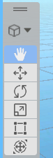

#### 오브젝트 위치(Position), 회전(Rotation), 크기(Scale) 조정

- Inspector에서 Position x, y, z값을 입력 또는 마우스로 좌우 드래그 형태로 변경
- Rotation, Scale도 동일하게 적용

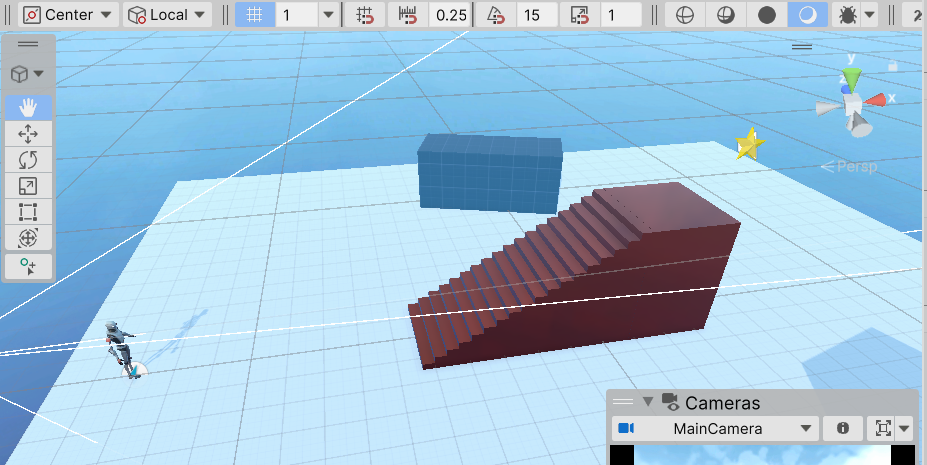

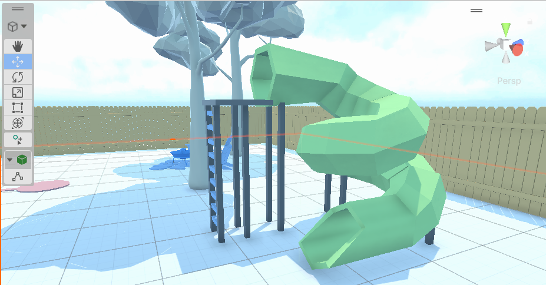

#### Kid's Room 꾸미기

- 방 오브젝트
- 침대, 카페트, 협탁, 알람시계, 침실 조명 등 위치 및 

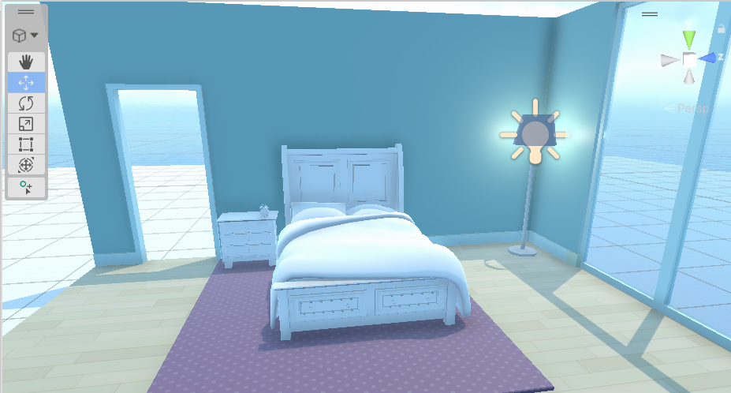

#### Material

- 오브젝트 재질 표현 객체
- Material 객체 생성 후 Inspector에서 조정

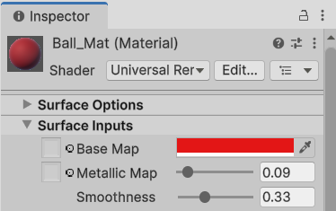

- Material 객체를 Ball 객체에 드래그

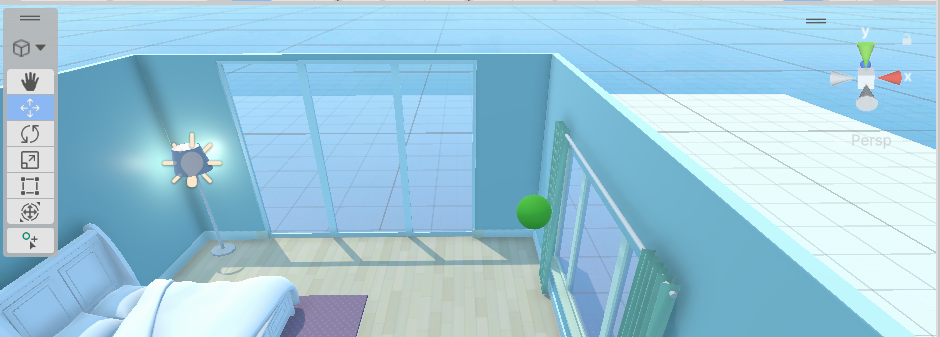

#### RigidBody

- 물리역학 기능 제공 컴포넌트
- Ball 선택 후 Inspector에서 Add Component 버튼 클릭

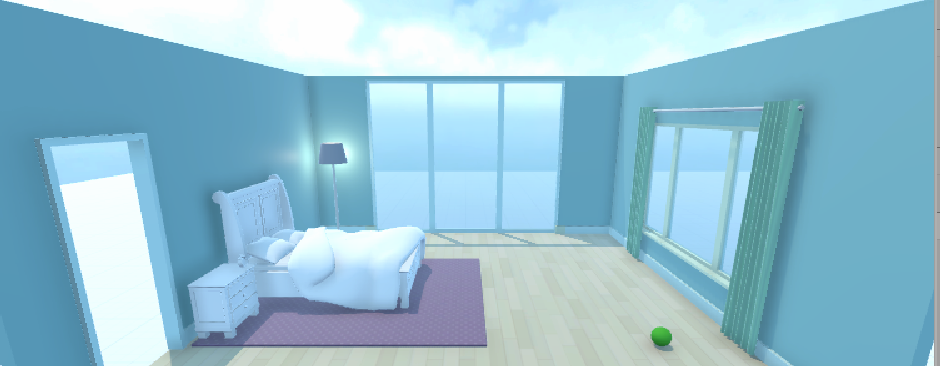

#### Physics Material

- 물체가 충돌할 때 마찰력, 반발력을 설정하는 자산
- Bounciness : 1 완전 탄성 충돌
    - 0.1(쇠구슬), 0.7(축구공), 0.9(고무공)

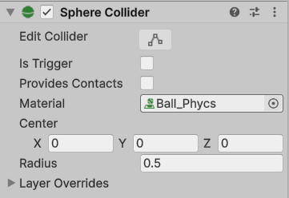

#### Ramp Object 추가

- 위치, 회전 지정
- Mesh Colider 컴포넌트 추가

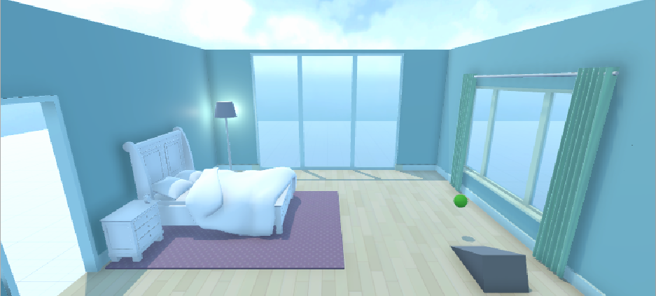

#### Block 객체 생성

- Cube로 생성
- Scale x:0.1, y:0.25, z:0.1로 설정. Ball이 튕겨서 닿는 위치
- Rigid Body 추가

#### 카메라 시점 변환

- Flythrough 모드로 이동 후
- 카메라 오브젝트 선택
- Ctrl + Shift + F : 현 카메라 시점을 플레이 카메라 시점으로 변경

#### 프리팹 변경

- Prefabs 폴더 내에 기존 Object 드래그하면 Prefab으로 변경

#### Block 쌓기

- Pivot을 Center로 변경 후
- 프리팹 Block을 쌓아올림

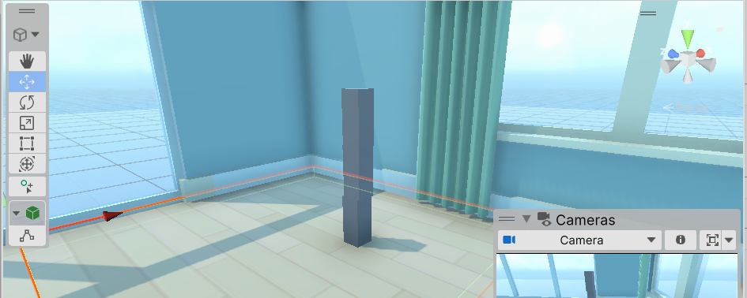

#### 프리팹 편집모드

- 프로젝트 창의 프리팹을 더블클릭
- Inspector 수정 후
- RigidBody > mass를 1보다 작게 수정(0.1)
- 충돌하는 물체의 mass의 상대적 반응
- Hierachy 창의 < 버튼 클릭

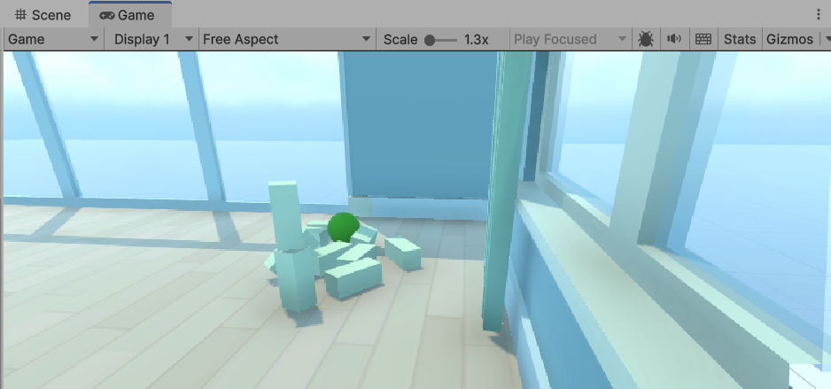

#### 라이트, 스카이박스 조정

- 라이트
    - y, z축으로 낮밤조정 가능
    - Emission > Color 조정 빛 색상조절
    - Emission > Light Appearance, Filter and Temperature 선택 후 빛의 온도를 조정

    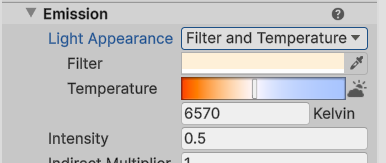

- 스카이박스
    - 하늘 전체 배경 변경
    - Materials > Skyboxes의 Material을 Scene뷰에 드래그

#### PlayMode 구분짓기

- Preferences > Colors > Play mode tints 색상을 어두운 색으로 변경
- Play시 UI 색상이 Edit모드와 다르게 표시

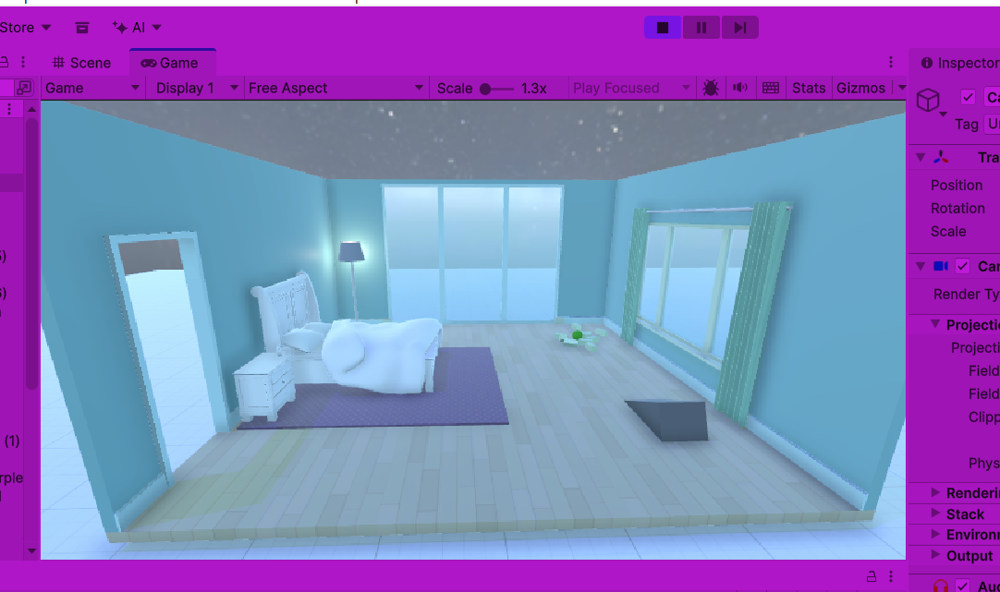

#### 피벗기능

- Object를 쌓을 때 v를 누르면 Object의 기준점 변경됨

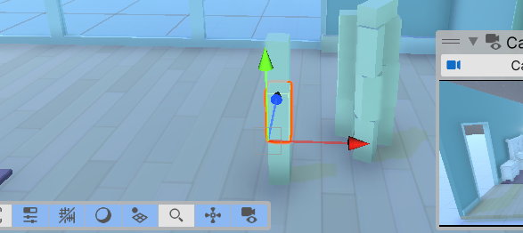

#### Chapter 2

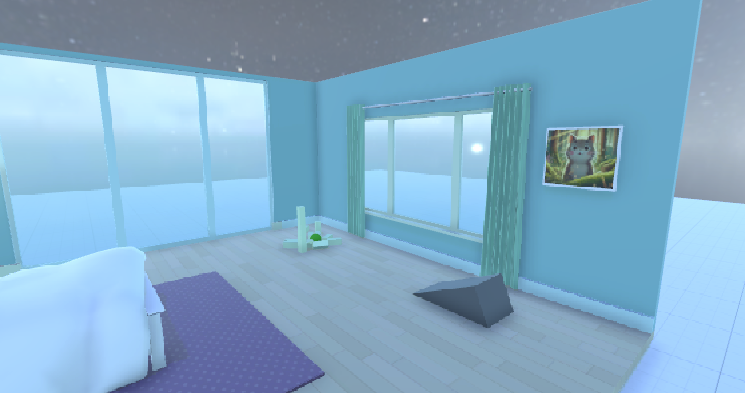

---

### 2-3. Unity Factory

- Unity Technologies Japan에서 제공하는 무료 HDRP 공장 시뮬레이션 에셋
- 공장 건물부터 컨베이어라인, 로봇팔, 작업자, 조명 등 제공
- https://assetstore.unity.com/ 에서 `Unity Factory` 검색

#### 프로젝트 생성

- HighDefinition 3D(HDRP) 프로젝트 생성
- My Asset에서 Unity Factory를 검색 후 Import

- Import 후 오류 발생
    - Spline Container 오류
        - Package Manager > Unity Registy, Splines 검색 후 설치

    - InputSystem 오류
        - 키보드, 마우스 입력 시스템이 Unity 6부터 변경
        - 예전 방식 입력시스템 사용
        - Project Settings > Player > Other Settings > Active Input Handling을 Old 또는 Both로 변경 후 에디터 재시작

    TODO - 비활성화하기 전 이미지추가

- Global Volume 오브젝트, 사용체크 비활성화

    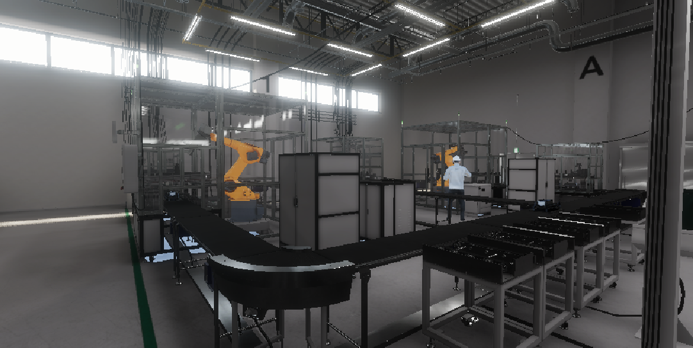