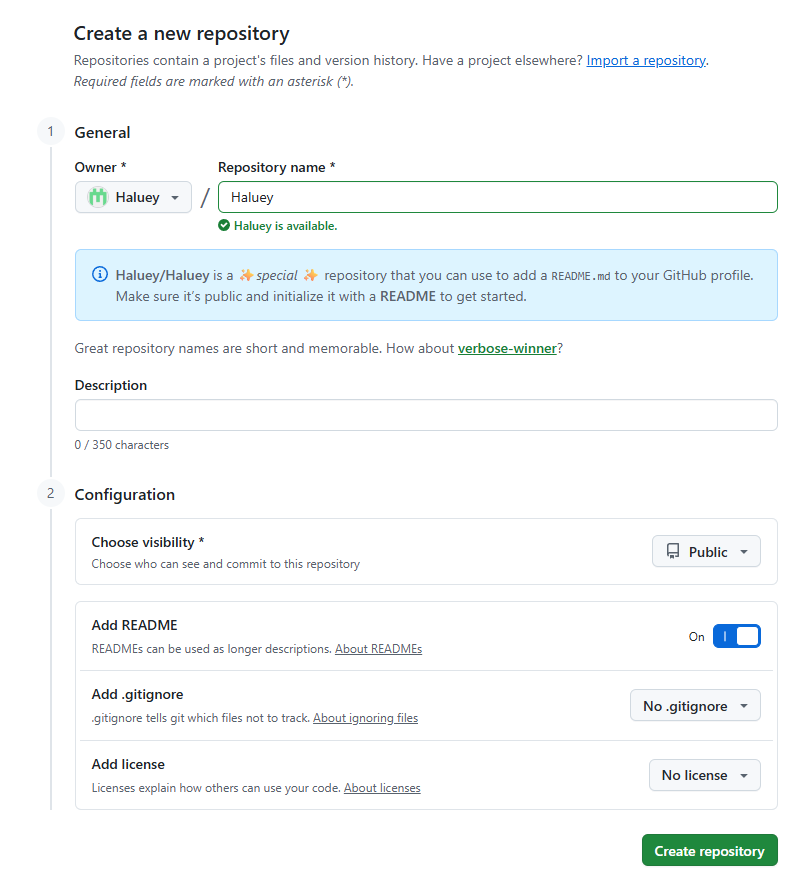
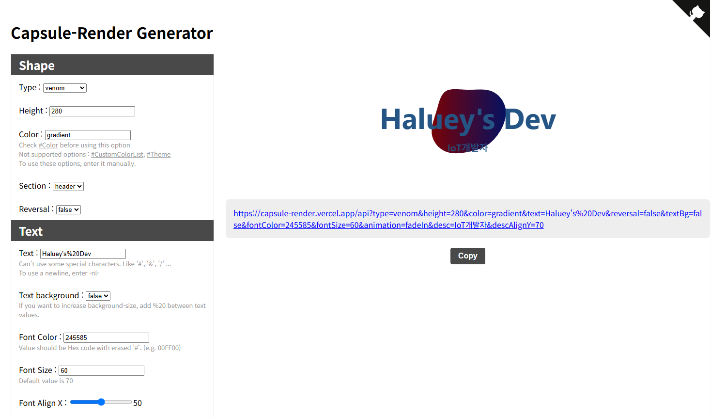

# 토이 프로젝트 3

## 깃허브 대문 작성

### 깃허브 리포지토리 생성

- 자신의 아이디와 동일한 이름으로 생성



### 헤더 이미지 생성

- https://capsule-render.vercel.app/ 



### 기본 프로필 작성

- 생략

### 기술스택 아이콘

#### 방법 1

- https://icons8.com/ 사용 언어, 기술에 대한 아이콘 검색

#### 방법 2

- https://img.shields.io/docs/logos
- https://simpleicons.org/

```html

```

- badge 뒤 기술명-아이디, log명을 https://simpleicons.org/ 에서 검색 후 변경

### 기술명세

- markdown이나 html에서 쓰는 테이블 생성

### Contribution 3D Graph

- https://github.com/yoshi389111/github-profile-3d-contrib

### 월드컵 스타일 뱃지

- https://github.com/Younesfdj/gitfut
