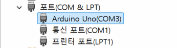
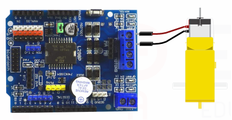
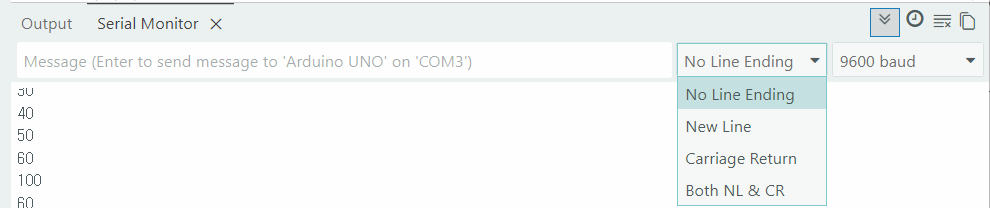
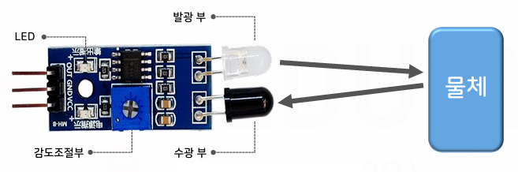
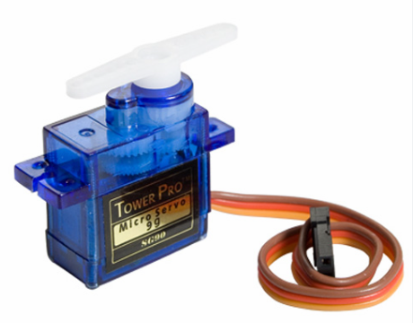
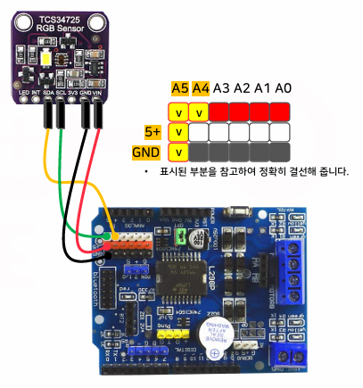
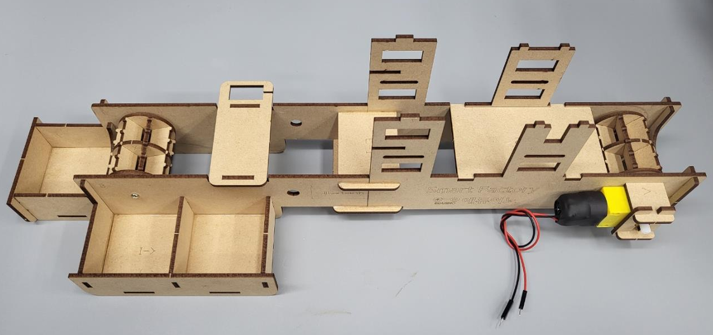
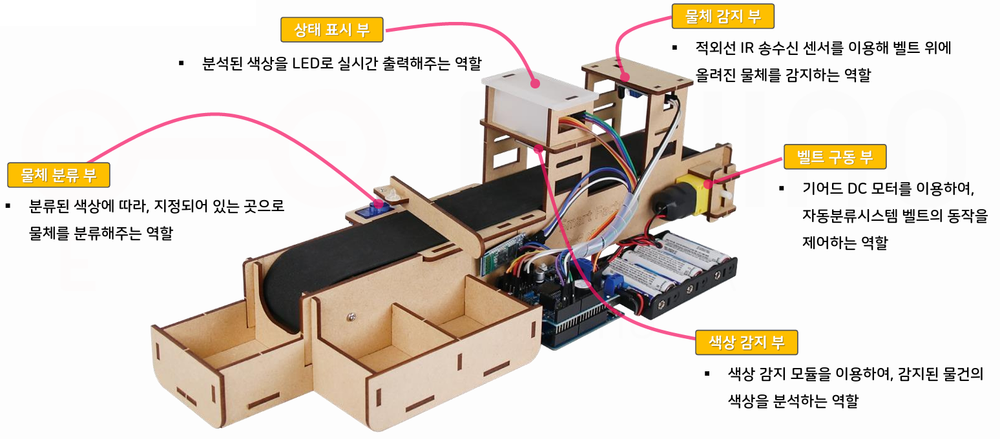

# 토이 프로젝트 5

## 컨베이어벨트 사용 공정관리 시스템

### 스마트팩토리

- 공장 내 모든 설비와 시스템을 연결, 데이터를 기반으로 생산을 최적화하는 제조 시스템

### 공장시스템 종류

- 회사 내 다양한 종류 시스템(SW) 구성, 사용 중

| 시스템명 | 역할 | 사용자 |
| :---: | :--- | :--- |
| SCM(공급체인 관리) | 원자재 구매, 협력업체, 물류관리 | 구매팀, 물류팀 |
| `ERP(전사적 자원관리)` | 회사전체 업무관리(결과위주) | 경영지원, 회계, 영업, 인사 등 |
| MES(생산계획 관리) | 생산현장 관리 | 생산관리자 |
| PLC(생산로직 제어) | 기계제어 | 설비 |
| SCADA | 설비모니터링 | 생산현장 |
| HMI(사람-기계 인터페이스) | 작업자 화면(터치패널) | 작업자 |
| WMS(창고관리) | 창고관리, 재고관리 | 물류 |
| QMS(품질관리) | 품질관리, 품질계획관리 | 품질팀 |
| CMMS(유지보수관리) | 설비 유지보수 | 설비팀 |


- 공정관리
    - MES의 한 파트인 공정(MRP:자재 소요 계획)을 실시간으로 모니터링, 제어
    - 스마트팩토리로 실시간으로 양품, 불량을 선별 후 데이터생성
    - Vision, IoT센서(적외선, X-ray, 스캐너 등)

- IIoT : Industrial IoT. 대규모, 높은 정밀도, 고가 등

### 전체 시스템 구조


### 아두이노 컨베이어벨트

#### 구성요소

##### L298P 쉴드(HAT)

- 모터 드라이버를 포함한 아날로그 PWM, 디지털 GPIO를 구성한 쉴드
- 모터 드라이버 : 서보, DC 등 모터를 쉽게 제어할 수 있도록 모듈화
- 모터 제어시 9V까지 전원 추가 - 아두이노 전원 불필요


- A - 디지털핀 13개
- B - 아날로그 확장 5개
- C - 아날로그핀 6개

- 확장핀 1 - PWM 확장핀. 5V, D6, D5, GND, D3(A와 공유)
- 확장핀 2 - 초음파센서 확장핀. 5V, D8, D7, GND
- 확장핀 3 - 서보모터 확장핀. GND, 5V, D9
- 확장핀 4 - 피에조 능동 부저. D4
- 확장핀 5 - 모터제어 포트. D13, D11, D12, D10 순서

#### 테스트



- Arduino IDE로 진행


- 부저 테스트

    ```cpp
    int buzzer = 4;

    void setup() {
      Serial.begin(9600);
      pinMode(buzzer, OUTPUT);
    }

    void loop() {
      digitalWrite(buzzer, HIGH);
      delay(1000);
      digitalWrite(buzzer, LOW);
      delay(2000);
    }
    ```

- 기어드 DC 모터 컨베이어 테스트
    - L298P 쉴드에 최소 9V 전원(최대 24V)인가
    - 2A 넘기지 말것

    ```cpp
    int motorSpeedPin = 10;
    int motorDirectionPin = 12;
    int value;

    void setup() {  
      pinMode(motorDirectionPin, OUTPUT);
      noTone(4);
    }

    void loop() {
      // 정방향
      digitalWrite(motorDirectionPin, HIGH);
      for (value = 0; value <= 255; value += 5) {
        analogWrite(motorSpeedPin, value);
        delay(30);
      }
      delay(1000);

      // 역방향
      digitalWrite(motorDirectionPin, LOW);
      for (value = 0; value <= 255; value += 5) {
        analogWrite(motorSpeedPin, value);
        delay(30);
      }
      delay(1000);
    }
    ```

- 기어드 DC 모터 제어 - [소스](./toyproject/ToyProjects05/arduino_part/sample01/sample01.ino)
    - 모터 스피드 값 0 ~ 255 사이에서 제어, 실제 50이하는 동작 안함
    - Default 80
    - 10부터 시작하면 60에서도 동작 안함. 255에서부터 줄여가면 50에서도 동작

    

- Serial Monitor 사용 주의점
    - 시리얼 입력에서 New Line, Carriage Return 선택 후 입력하면 값 이외에 다른데이터 전달됨

    

    

- 적외선 IR 송수신 센서

    

    ```cpp
    // 적외선 IR 센서
    int sensor = A0;
    int val;

    void setup() {
      Serial.begin(19200);
      pinMode(sensor, INPUT);
      Serial.println("Arduino start!");
    }

    void loop() {
      val = digitalRead(sensor);

      if (val == LOW) {
        Serial.println("Detected");
        delay(300);
      }
      else {
        Serial.println("0");
        delay(300);
      }
    }
    ```

    

- 서보모터 SG-90
    - 확장핀 3 연결, 시그널 D9 전달
    - 각도 초기화 한 후 바를 연결

    

    ```cpp
    // 서보모터
    #include <Servo.h>
    #define SERVO_PIN 9  // Digital 9
    Servo servo;

    void setup() {
      Serial.begin(19200);
      servo.attach(SERVO_PIN);  // 서보모터 연결
      servo.write(0);  // 0도로 초기화(중요!)
      delay(500);
    }

    void loop() {
      if (Serial.available()) {
        int value = Serial.parseInt();
        servo.write(value);
        Serial.println(value);
        delay(100);
      }
    }
    ```
    
    https://github.com/user-attachments/assets/c67e2286-4f0b-4a15-a695-4a190889efa8

- RGB LED 네오픽셀
    - Adafruit NeoPixel 라이브러리 추가

    ```cpp
    // NeoPixel LED 
    #include <Adafruit_NeoPixel.h>
    #define PIN 5
    #define NUMPIXELS 3

    Adafruit_NeoPixel pixels(NUMPIXELS, PIN, NEO_GRB + NEO_KHZ800);

    void setup() {
      pixels.begin();
      pixels.setBrightness(50);
    }

    void loop() {
      for (int i=0; i < NUMPIXELS; i++) {
        pixels.setPixelColor(i, pixels.Color(255, 0, 0));
        pixels.show();
      }
      delay(1000);

      for (int i=0; i < NUMPIXELS; i++) {
        pixels.setPixelColor(i, pixels.Color(0, 255, 0));
        pixels.show();
        delay(10);
      }
      delay(1000);

      for (int i=0; i < NUMPIXELS; i++) {
        pixels.setPixelColor(i, pixels.Color(0, 0, 255));
        pixels.show();
        delay(10);
      }
      delay(1000);
    }
    ```

    - 1초당 RGB 색상 변경 확인

- 컬러센서(TCS34725) 모듈
    - RGB 색상 감지 
    - Adafruit TCS34725 라이브러리 설치

    

    ```cpp
    // Color Sensor
    #include <Wire.h>
    #include <Adafruit_TCS34725.h>

    Adafruit_TCS34725 TCS = Adafruit_TCS34725(TCS34725_INTEGRATIONTIME_50MS, TCS34725_GAIN_4X);

    void setup() {
      Serial.begin(19200);
      TCS.begin();  
    }

    void loop() {
      uint16_t clear, red, green, blue;
      delay(100);
      TCS.getRawData(&red, &green, &blue, &clear);

      int r = map(red, 0, 21504, 0, 2000);
      int g = map(green, 0, 21504, 0, 2000);
      int b = map(blue, 0, 21504, 0, 2000);

      Serial.print("    R: ");
      Serial.print(r);
      Serial.print("    G: ");
      Serial.print(g);
      Serial.print("    B: ");
      Serial.println(b);
    }
    ```

    - 색상 테스트

        

        - 초기상태 : RGB(4, 3, 3)
        - 빨간색 물체 : RGB(21, 6, 6)
        - 초록색 물체 : RGB(14, 18, 10)
        - 파랑색 물체 : RGB(8, 11, 15)
        - ~~보라색 물체 : RGB(11, 9, 14)~~
        - ~~주황색 물체 : RGB(29, 15, 9)~~
        - ~~노란색 물체 : RGB(41, 32, 13)~~

#### 컨베이어벨트 조립

- 조립중간 단계

    

- 완성 단계

    

#### 통합로직 구현

- [전체소스](./toyproject/ToyProjects05/arduino_part/sortingmachine/sortingmachine.ino)

#### Arduino 교체 테스트

- [Arduino UNO R3](https://www.devicemart.co.kr/goods/view?no=34404)에서 [Arduino UNO R4](https://www.devicemart.co.kr/goods/view?no=15088648)로 교체

- 결론 - `Adafruit` 등 라이브러리 UNO R4에서 사용불가

#### IR 적외선 센서팁

- 레일에 파란색, 검은색 전기테이프도 인식됨

#### 기본 동작

https://github.com/user-attachments/assets/86871893-f25b-450e-a844-4851ff365419

### 라즈베리파이 연결

- 아두이노 + 라즈베리파이 5

#### MQTT 통신 구현

- Raspbian -> Windows 통신

### Unity 디지털트윈 시스템

### WPF 모니터링 시스템

