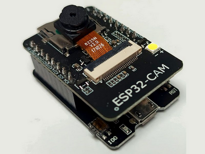
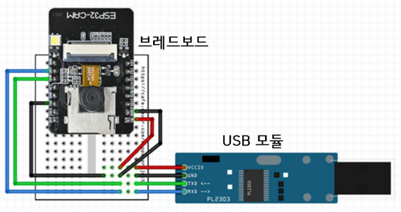
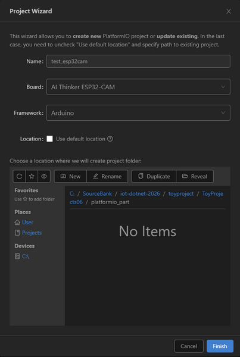
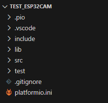
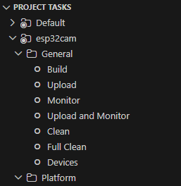
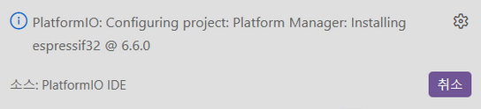
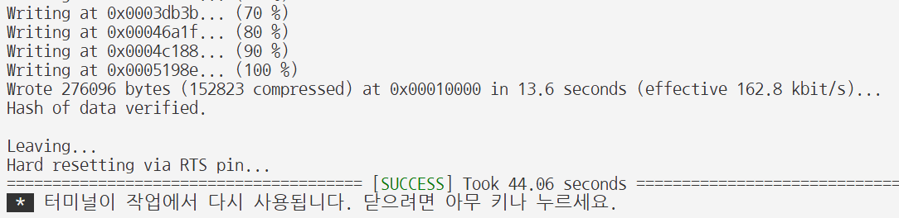
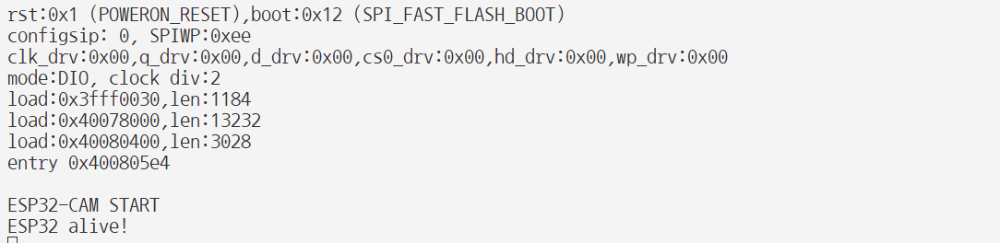
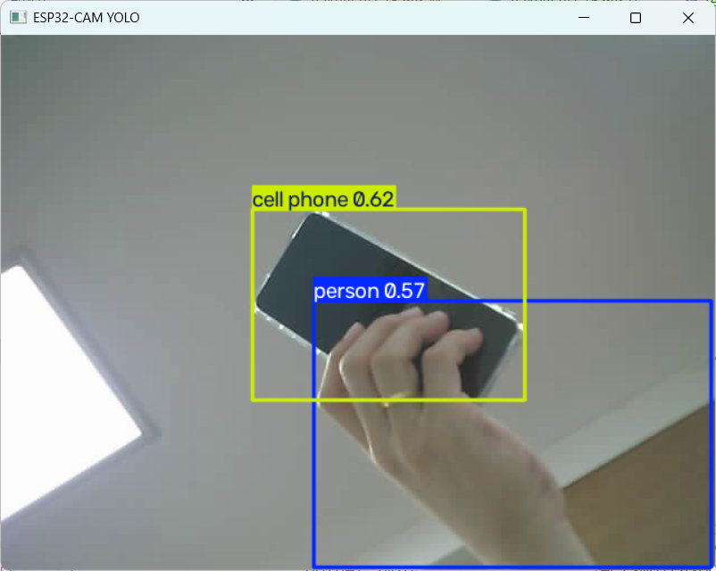

# 토이 프로젝트 6

## 컨베이어벨트 공정관리 시스템 2

### ESP32-CAM

#### 개요



**Ai-Thinker ESP32-CAM**

ESP32 기반 프로세서 사용, WiFi, 블루투스를 지원하는 아두이노 호환보드

업로드 모듈을 사용하지 않을 경우, 아래와 같이 브레드보드, USB모듈을 직접 연결해야 함



#### 기본사양 일부

- Bluetooth 4.2, BLE
- WiFi 802.11 전부가능
- USB b타입 지원
- microSD 4G까지 지원 - 사진 및 데이터 저장
- 외부 안테나 연결 가능

#### 활용처

- 카메라 촬영
- 실시간 영상 스트리밍
- Wi-Fi 통신
- 자체 웹 서버 기능
- 간단한 영상/물체 감지 - Arduino TinyML
- IoT 기능도 포함
- UART - Arduino, Raspberry Pi와 시리얼 통신

##### ESP32-CAM 사용이유

- 라즈베리파이 직접 카메라를 장착하려면 - RPi Camera 또는 USB 웹캠 가능
- 컨베이어벨트 등 산업장비에 설치, 독립적으로 스트리밍을 가능하게 하기 위해서 사용
- 저사양으로 테스트용으로 사용. 실제 산업현장용은 고비용 고사양


#### 개발환경 설정

Arduino IDE 나 Visual Stduio Code - PlatformIO 확장으로 사용 등 여러방법 존재

##### VS Code - PlatformIO IDE

- VS Code 확장 
- Install
- Python 설치되어 있지않으면 병행 설치됨
- 새로 리로드 필요

##### PlatformIO IDE 프로젝트 생성

1. PlatformIO 아이콘 클릭(pio)
2. Quick Access에서 New Project 선택

    - 프로젝트 명, Board : AI Thinker ESP32-CAM, Framework : Arduino 선택

    - Finish



##### PlatformIO 프로젝트 구조

- 프로젝트 폴더 구조
    - include : 헤더파일 위치
    - lib : 외부라이브러리 저장
    - src : cpp파일 위치
    - test : 단위 테스트용
    - platformio.ini : 사용할 보드 설정

    

- 프로젝트 태스크 구조
    - Build : 빌드 컴파일
    - Upload : 보드 업로드
    - Monitor : 시리얼 모니터
    - Upload and Monitor : 업로드 후 시리얼 모니터 오픈
    - Clean / Full Clean : 소스 정리
    - Devices : 보드 정보 확인

    

    - 윈도우 장치 관리자에서 시리얼포트 확인, 라즈베리파이에서는 /dev/ttyUSB*

##### ESP32-CAM 동작확인

- [platformio.ini](./toyproject/ToyProjects06/platformio_part/test_esp32cam/platformio.ini) 작성 - 버전 변경(6.6.0) 후 저장하면 프로젝트 재구성 시간소요

    

- 기본동작 소스 테스트

    ```cpp
    #include <Arduino.h>

    void setup() {
    Serial.begin(115200);

    delay(2000);

    Serial.println();
    Serial.println("ESP32-CAM START");
    }

    void loop() {
    Serial.println("ESP32 alive!");

    delay(1000);
    }
    ```

- PlatformIO 프로젝트 태스크 > Build 클릭
- Build 성공하면 [SUCCESS] 출력
- 최초 Upload시 Tool Manager 다운로드 설치 시간소요

    

- 업로드 %가 표시

    

- 프로젝트 태스크 > Monitor 클릭

- ESP32-CAM보드 > RST 버튼 클릭 초기화

    

- 기본명령어
    - 빌드 : `platformio run`
    - 실제 : `platformio.exe run --environment esp32cam `
    - 빌드 + 업로드 : `platformio run --target upload`
    - 시리얼 모니터 : `platformio device monitor`
    - Clean : `platformio run --targer clean`

##### ESP32-CAM 웹서버 예제

- [소스](./toyproject/ToyProjects06/platformio_part/test_esp32cam/src/main.cpp)

- 빌드, 업로드 후 모니터 확인

    

- 테스트

    

- 특이사항
    - ESP32-CAM 저사양으로 한번에 여러개 접속 불가능
    - WiFi 2.4GHz만 지원(5G 이상 접속 불가)
    - 웹브라우저 오픈 + Python YOLO 동시에 처리하면 스트리밍 끊김
    - TinyML이라는 머신러닝 라이브러리로 AI 처리 가능 - 느려서 사용 어려움
    - ESP32-CAM은 영상만 스트리밍. 물체인식 등은 라즈베리파이에서 Python으로 처리

#### Python OpenCV, YOLO 연계

- 기본적인 [OpenCV 소스](./toyproject/ToyProjects06/raspberrypi_part/test_opencv.py) 동작 확인
- 기본적인 [YOLO 소스](./toyproject/ToyProjects06/raspberrypi_part/test_yolo.py) 동작 확인

    

- 색상으로 인식할 모델 생성 또는 검색

#### ESP32-CAM 전원만 인가


ESP32-CAM 동작확인

#### 라즈베리파이 + ESP32-CAM

- 윈도우에서 ESP32-CAM 빌드, 업로드한 보드가 라즈베리파이에서 동작 실패
- 컬러센서에서 인식하는 부분에 카메라 위치


