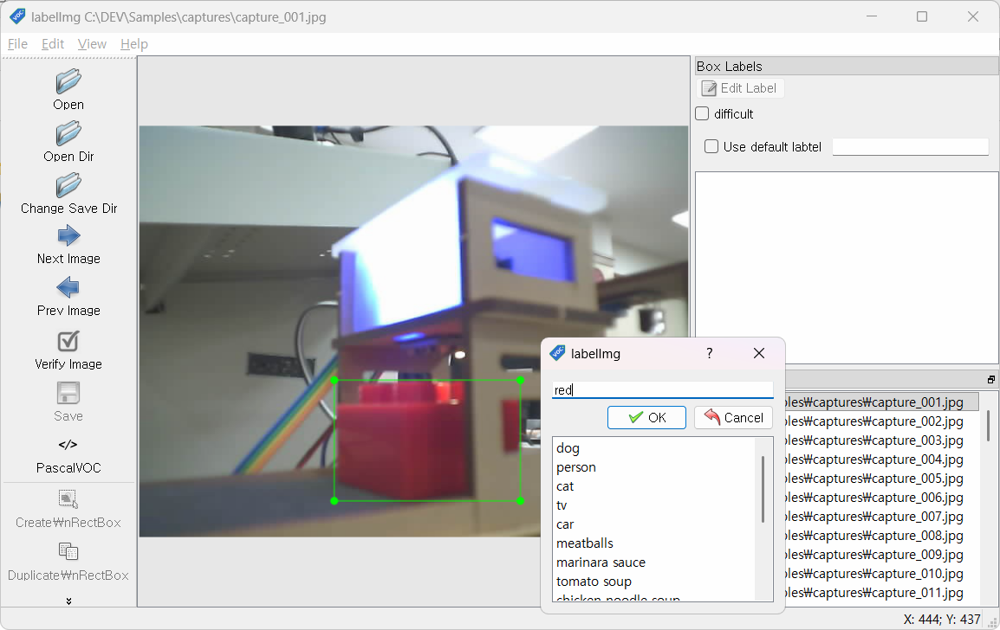
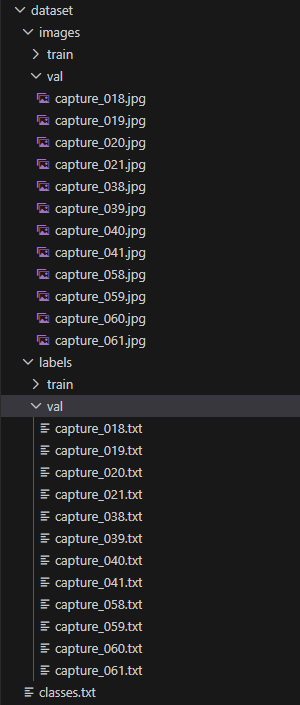
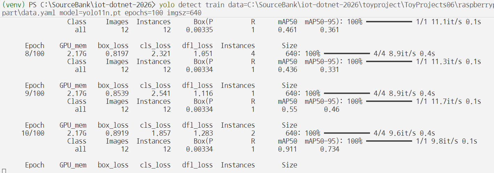
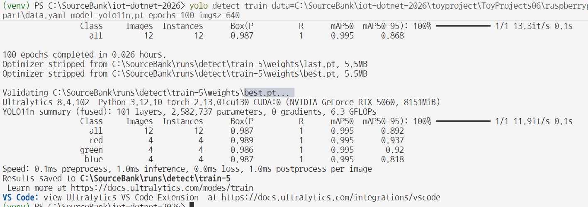
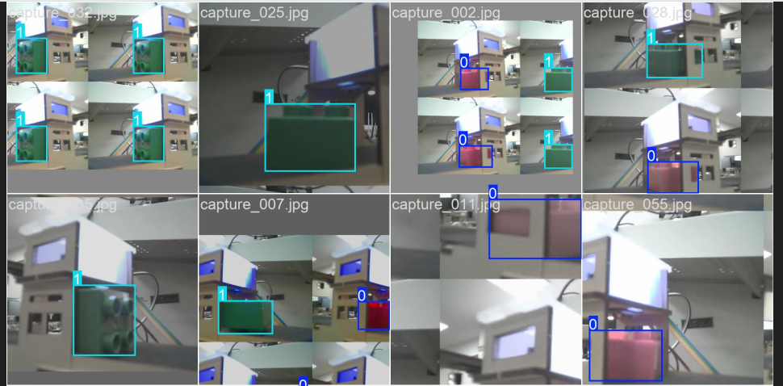
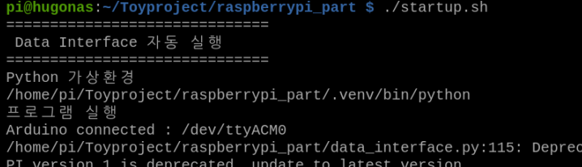
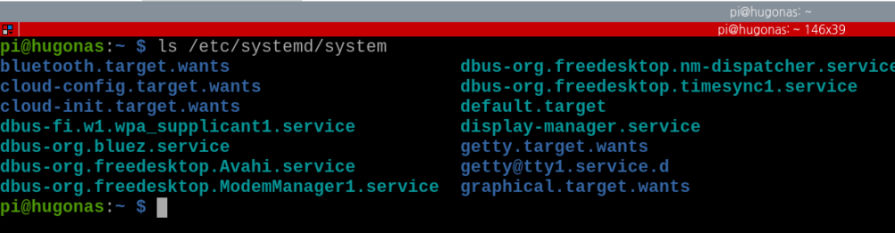
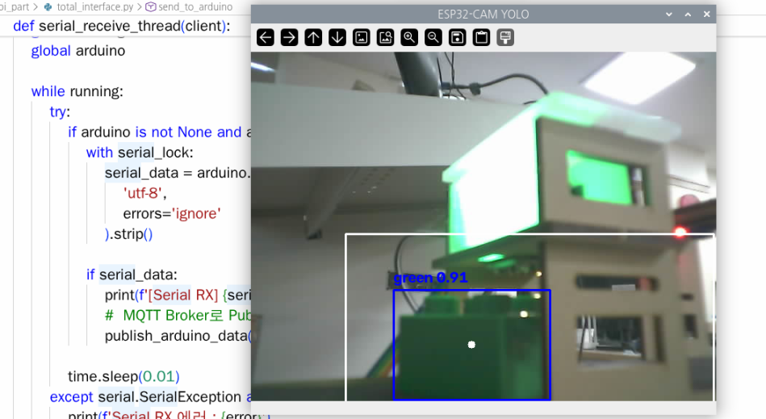

# 토이 프로젝트 6

## 컨베이어벨트 공정관리 시스템 2

### ESP32-CAM

#### 개요


**Ai-Thinker ESP32-CAM**

ESP32 기반 프로세서 사용, WiFi, 블루투스를 지원하는 아두이노 호환보드

업로드 모듈을 사용하지 않을 경우, 아래와 같이 브레드보드, USB모듈을 직접 연결해야 함


#### 기본사양 일부

- Bluetooth 4.2, BLE
- WiFi 802.11 전부가능
- USB b타입 지원
- microSD 4G까지 지원 - 사진 및 데이터 저장
- 외부 안테나 연결 가능

#### 활용처

- 카메라 촬영
- 실시간 영상 스트리밍
- Wi-Fi 통신
- 자체 웹 서버 기능
- 간단한 영상/물체 감지 - Arduino TinyML
- IoT 기능도 포함
- UART - Arduino, Raspberry Pi와 시리얼 통신

##### ESP32-CAM 사용이유

- 라즈베리파이 직접 카메라를 장착하려면 - RPi Camera 또는 USB 웹캠 가능
- 컨베이어벨트 등 산업장비에 설치, 독립적으로 스트리밍을 가능하게 하기 위해서 사용
- 저사양으로 테스트용으로 사용. 실제 산업현장용은 고비용 고사양


#### 개발환경 설정

Arduino IDE 나 Visual Stduio Code - PlatformIO 확장으로 사용 등 여러방법 존재

##### VS Code - PlatformIO IDE

- VS Code 확장 
- Install
- Python 설치되어 있지않으면 병행 설치됨
- 새로 리로드 필요

##### PlatformIO IDE 프로젝트 생성

1. PlatformIO 아이콘 클릭(pio)
2. Quick Access에서 New Project 선택

    - 프로젝트 명, Board : AI Thinker ESP32-CAM, Framework : Arduino 선택

    - Finish


##### PlatformIO 프로젝트 구조

- 프로젝트 폴더 구조
    - include : 헤더파일 위치
    - lib : 외부라이브러리 저장
    - src : cpp파일 위치
    - test : 단위 테스트용
    - platformio.ini : 사용할 보드 설정

    

- 프로젝트 태스크 구조
    - Build : 빌드 컴파일
    - Upload : 보드 업로드
    - Monitor : 시리얼 모니터
    - Upload and Monitor : 업로드 후 시리얼 모니터 오픈
    - Clean / Full Clean : 소스 정리
    - Devices : 보드 정보 확인

    

    - 윈도우 장치 관리자에서 시리얼포트 확인, 라즈베리파이에서는 /dev/ttyUSB*

##### ESP32-CAM 동작확인

- [platformio.ini](./toyproject/ToyProjects06/platformio_part/test_esp32cam/platformio.ini) 작성 - 버전 변경(6.6.0) 후 저장하면 프로젝트 재구성 시간소요

    

- 기본동작 소스 테스트

    ```cpp
    #include <Arduino.h>

    void setup() {
    Serial.begin(115200);

    delay(2000);

    Serial.println();
    Serial.println("ESP32-CAM START");
    }

    void loop() {
    Serial.println("ESP32 alive!");

    delay(1000);
    }
    ```

- PlatformIO 프로젝트 태스크 > Build 클릭
- Build 성공하면 [SUCCESS] 출력
- 최초 Upload시 Tool Manager 다운로드 설치 시간소요

    

- 업로드 %가 표시

    

- 프로젝트 태스크 > Monitor 클릭

- ESP32-CAM보드 > RST 버튼 클릭 초기화

    

- 기본명령어
    - 빌드 : `platformio run`
    - 실제 : `platformio.exe run --environment esp32cam `
    - 빌드 + 업로드 : `platformio run --target upload`
    - 시리얼 모니터 : `platformio device monitor`
    - Clean : `platformio run --targer clean`

##### ESP32-CAM 웹서버 예제

- [소스](./toyproject/ToyProjects06/platformio_part/test_esp32cam/src/main.cpp)

- 빌드, 업로드 후 모니터 확인

    

- 테스트

    

- 특이사항
    - ESP32-CAM 저사양으로 한번에 여러개 접속 불가능
    - WiFi 2.4GHz만 지원(5G 이상 접속 불가)
    - 웹브라우저 오픈 + Python YOLO 동시에 처리하면 스트리밍 끊김
    - TinyML이라는 머신러닝 라이브러리로 AI 처리 가능 - 느려서 사용 어려움
    - ESP32-CAM은 영상만 스트리밍. 물체인식 등은 라즈베리파이에서 Python으로 처리

#### Python OpenCV, YOLO 연계

- 기본적인 [OpenCV 소스](./toyproject/ToyProjects06/raspberrypi_part/test_opencv.py) 동작 확인
- 기본적인 [YOLO 소스](./toyproject/ToyProjects06/raspberrypi_part/test_yolo.py) 동작 확인

    

- 색상으로 인식할 모델 생성 또는 검색

#### ESP32-CAM 전원만 인가


ESP32-CAM 동작확인

#### 라즈베리파이 + ESP32-CAM

- 윈도우에서 ESP32-CAM 빌드, 업로드한 보드가 라즈베리파이에서 동작 실패
- 컬러센서에서 인식하는 부분에 카메라 위치


### 물체인식 기능 추가

#### Raspberry Pi Global Python에 PIP 라이브러리 설치방법

- 라즈비안 Wormbook부터 글로벌 Python은 PIP로 라이브러리 설치가 금지(방지)

    ```bash
    $ pip install ~
    error : externally-managed-environment
    ```

- 위 명령을 무시하고 설치하고자 하면

    ```bash
    ## 1번째 방법
    $ sudo rm /usr/lib/python3.13/EXTERNALLY-MANAGED
    # 삭제 후
    $ pip install ~

    ## 2번째 방법
    $ pip install ~ --break-system-packages
    ```

#### Raspberry Pi YOLO 설치 시 주의점

- YOLO 설치 (Python 가상환경)을 아래와 같이하면

    ```bash
    (.venv)$ pip install opencv-python 
    (.venv)$ pip install ultralytics # YOLO 설치하면서 PyTorch와 같이 설치 
    ```

    - YOLO로 자동설치되는 PyTorch는 GPU버전이 설치됨
    - ARM64 버전에 Nvidia Jetson Nano들은 GPU가 설치되어 있음
    - MicroSD 32GB에서는 pip캐시 저장용량, ssd tmp 드라이브 용량이 모자람

- Raspberry Pi에서 YOLO를 설치하려면 아래의 명령으로 진행할 것

    ```bash
    (.venv)$ pip install opencv-python
    (.venv)$ pip install torch torchvision --index-url https://download.pytorch.org/whl/cpu 
    (.venv)$ pip install ultralytics # YOLO만 설치
    ```

#### YOLO 물체인식

- ESP32-CAM으로 컬러센서 대신 물체인식 변경
- YOLO에서 사용할 커스터마이징 모델 훈련, 생성
- 현재 벨트상황에서 훈련시킬 물체 사진 캡쳐
    - 최소 색상별(Red, Green, Blue) 100장 이상 캡쳐

#### ESP32-CAM 캡쳐 기능

- 보드 재부팅 현상 발생
- 보류

#### Python OpenCV 캡쳐 기능

- [소스](./toyproject/ToyProjects06/raspberrypi_part/test_capture.py)


#### YOLO Pretrained Model 생성

생산품 색상별 인식할 수 있는 YOLO 모델 생성해야 함

YOLO 커스텀 학습이 필요

1. 이미지 셋 준비 (색상별 100장 이상)
2. **라벨링**
3. `YOLO 형식에 맞게 export`
4. 데이터 셋 폴더 구성 - Train 폴더 / Validation 폴더
5. data.yaml 작성
6. YOLO로 학습

##### 라벨링 툴

- [Robotflow](https://roboflow.com/) - 유료 라벨링 사이트
- [cvat.ai](https://www.cvat.ai/) - 유료 라벨링 사이트. export 시 결재 팝업
- [labelmg](https://github.com/HumanSignal/labelImg) - 무료툴 Github 오픈소스

##### LabelImg툴 사용법



##### YOLO 학습 폴더(데이터셋) 구성

- YOLO 학습을 위한 데이터셋 구성
    - train : val - 8 : 2로
    - images > train, val 
    - labels > train, val 

    

    - data.yaml 작성

##### YOLO 학습

- `Fine-tuning` : 기존 yolo11n.pt 사전학습 모델을 가져와서 필요한 Red/Green/Blue 데이터로 재학습

- YOLO 사전학습 모델 기반으로 학습
    - data.yaml 절대경로로 작성
    - Ultralytics 패키지 폴더 setting.json 파일 내 
        - 윈도우 경우 C:\Users\User\AppData\Roaming\Ultralytics\setting.json
        - `dataset_dir`(훈련시킬 데이터셋 경로로 지정), weights_dir, runs_dir

    ```bash
    yolo detect train data=C:\SourceBank\iot-dotnet-2026\toyproject\ToyProjects06\raspberrypi_part\data.yaml model=yolo11n.pt epochs=100 imgsz=640
    ```

    - 훈련 진행중 화면

        

    - 결과 화면. 모델 파일 위치 확인

        

    - 훈련 중간 배치 이미지 확인

        

    - 훈련모델 물체인식 테스트

        ```powershell
        (venv) PS C:\...\iot-dotnet-2026> yolo detect predict model=../runs/detect/train-5/weights/best.pt source=.\toyproject\ToyProjects06\raspberrypi_part\dataset\images\val\capture_018.jpg

        Ultralytics 8.4.102  Python-3.12.10 torch-2.13.0+cu130 CUDA:0 (NVIDIA GeForce RTX 5060, 8151MiB)
        YOLO11n summary (fused): 101 layers, 2,582,737 parameters, 0 gradients, 6.3 GFLOPs

        image 1/1 C:\SourceBank\iot-dotnet-2026\toyproject\ToyProjects06\raspberrypi_part\dataset\images\val\capture_018.jpg: 480x640 1 red, 35.3ms
        Speed: 1.2ms preprocess, 35.3ms inference, 10.0ms postprocess per image at shape (1, 3, 480, 640)
        Results saved to C:\SourceBank\runs\detect\predict-5
        Learn more at https://docs.ultralytics.com/modes/predict
        VS Code: view Ultralytics VS Code Extension  at https://docs.ultralytics.com/integrations/vscode
        ```

##### 라즈베리파이 실시간 확인

- best.pt파일 이전
- raspberrypi_yolo.py실행

    

- 실시간 물체인식 확인

### 기존 컨베이어벨트 키트와 통합

#### OS 부팅시 자동실행 처리

- 라즈베리파이에서 부팅 후 자동프로그램 실행

- 자동 실행 방법
    - .bashrc : 터미널 열 때 마다 실행. 항상 일정. ROS2 시스템 초기화 사용
    - Autostart : GUI 로그인 후 실행. 라즈비안 버전마다 명령어가 변경
    - crontab @reboot : 일정시간마다 실행되도록 하는 명령 포함
    - systemd : 부팅 자동실행, 재시작, 로그 관리

##### Autostart 실행 방법

- 라즈비안 버전 마다 상이
- ~~Raspbian Trixie 경우 : /etc/xdg/lxsession/rpd-x/autostart~~ 사용 불가
- labwc 윈도우 매니저 방식의 autostart 사용

- 프로젝트 폴더에 실행용 쉘 startup.sh 생성
- `sudo nano ./startup.sh` 실행

    ```bash
    $ cd /home/pi/Toyproject/raspberrypi_part
    $ sudo nano ./startup.sh
    ```

- 아래 내용 작성

    ```sh
    #!/bin/bash

    sleep 5

    cd /home/pi/Toyproject/raspberrypi_part

    echo "=============================="
    echo "   Data Interface 자동 실행   "
    echo "=============================="

    source .venv/bin/activate

    echo "Python 가상환경"
    which Python

    echo "프로그램 실행"
    python -u data_interface.py

    echo "프로그램 종료"
    read
    ```

- startup.sh에 실행권한 추가 및 파일 소유자 변경

    ```bash
    $ sudo chmod +x ./startup.sh   # 실행권한 추가
    $ sudo chown pi:pi startup.sh  # 파일 소유자 변경
    ```

    

- 사전 테스트 : 재부팅 전에 동작 확인

    

- autostart 파일 추가

    ```bash
    $ mkdir -p ~/.config/labwc
    $ nano ~/.config/labwc/autostart

    # autostart 파일 내 아래 명령어 추가 후 저장
    lxterminal -e /home/pi/Toyproject/raspberrypi_part/startup.sh &
    ```

- 재부팅 확인
    - 컨베이어 벨트 : 추가 전원으로 계속 동작
    - ESP32-CAM : 전원들어오면 먼저 웹서버 실행
    - MQTT, YOLO Python : 라즈비안 부팅 완료 후 실행

##### systemd 서비스로 자동 실행

- /etc/systemd/system 아래 다른 서비스 확인

    

- service 파일 생성

    ```bash
    $ sudo nano /etc/systemd/system/datainterface.service
    ```

    ```ini
    [Unit]
    Description=Python MQTT Service
    After=network.target

    [Service]
    Type=simple
    User=pi
    WorkingDirectory=/home/pi/Toyproject/raspberrypi_part

    ExecStart=/home/pi/Toyproject/raspberrypi_part/startup.sh

    Restart=always
    RestartSec=5

    [Install]
    WantedBy=multi-user.target
    ```

- systemd에 새 서비스 알려주기

    ```bash
    $ sudo systemctl daemon-reload
    ```

- 부팅 자동실행 등록 및 해제

    ```bash
    $ sudo systemctl enable datainterface.service   # 등록
    $ sudo systemctl disable datinterface.service   # 해제
    ```

- 사전 테스트

    ```bash
    $ sudo systemctl start datinterface.service     # 시작
    $ sudo systemctl status datinterface.service    # 로그 확인

    ● datainterface.service - Python MQTT Service
        Loaded: loaded (/etc/systemd/system/datainterface.service; enabled; preset: enabled)
        Active: active (running) since Thu 2026-08-13 11:15:45 KST; 19s ago
    Invocation: 3661f6daef644b8190198c11756c8b2c
    Main PID: 2579 (startup.sh)
        Tasks: 3 (limit: 4805)
            CPU: 137ms
        CGroup: /system.slice/datainterface.service
                ├─2579 /bin/bash /home/pi/Toyproject/raspberrypi_part/startup.sh
                └─2582 python -u data_interface.py

    8월 13 11:15:45 hugonas startup.sh[2579]: Python 가상환경
    8월 13 11:15:45 hugonas startup.sh[2581]: /home/pi/Toyproject/raspberrypi_part/.venv/bin/python
    ...

    $ sudo systemctl stop datinterface.service  # 정지
    ```

- 재부팅 후 확인
    - 로그 출력은 되나 sytemctl status를 다시 실행해야 최신로그 확인됨

##### 결론

autostart 사용할 것

#### YOLO + MQTT 통합, 아두이노 제어

- 컨베이어 벨트에서 컬러 센서로 색상 판별
- YOLO로 변경
    - YOLO에서 감지한 색상을 시리얼통신으로 아두이노로 전달
    - MQTT로 데이터 배포

- 아두이노 시리얼 통신으로 YOLO 값 수신
- 색상별 각도 조절, 벨트 동작

##### YOLO 물체 감지영역 변경

- ROI(Region Of Interest) : 관심영역으로 물체 인식 범위 지정
- ROI 영역을 벗어나면 물체 인식 안 됨


##### Python YOLO 소스와 MQTT 통신소스 통합

- data_interface.py 와 test_yolo.py 소스 통합
- 물체인식 동시에 MQTT로 데이터 Publish
- total_interface.py - [소스](./toyproject/ToyProjects06/raspberrypi_part/total_interface.py)



- 물체인식 가능, MQTT 물체 Detect 이후 값 전달 안됨 -> 벨트 중지
- 전달 위한 publish_yolo_data() 함수 작성


- 1초에 수번 ~ 수십번 MQTT 배포를 하는 상황

##### 한 가지 물체 인식 쿨다운 기능 적용

- 같은 물체 인식을 일정 시간동안 막았다가 다시 보내는 쿨다운 기능 추가
- 증복 전송 방지 변수 추가, 물체인식 후 일정 시간 동안 데이터 전송 막기 로직 추가
- 물체 인식하고 아두이노에 서보모터 각도 조절 제어 후 벨트 동작까지 시간 확보 위해서

##### Python에서 Arduino로 시리얼통신 전송

- 클래스 명에 따라 R, G, B로 아두이노로 시리얼 데이터 전송

```bash
[YOLO ROI] blue 0.72
[YOLO MQTT PUB] {"deviceId": "IOT52-RPI", "timestamp": "2026-08-14T11:32:22.180815", "color": "blue", "confidence": 0.72}
serial_data = B

[YOLO ROI] green 0.95
[YOLO MQTT PUB] {"deviceId": "IOT52-RPI", "timestamp": "2026-08-14T11:32:49.541849", "color": "green", "confidence": 0.95}
serial_data = G

[YOLO ROI] red 0.86
[YOLO MQTT PUB] {"deviceId": "IOT52-RPI", "timestamp": "2026-08-14T11:33:00.031396", "color": "red", "confidence": 0.86}
serial_data = R 
```

##### Arduino에서 수신된 값으로 서보모터 제어

- 아두이노 소스에 processSerialCommand(char command), setProductColor(char color) 함수 추가
- [sortingmachine.ino](./toyproject/ToyProjects06/arduino_part/sortingmachine.ino)

##### 실행결과

https://github.com/user-attachments/assets/f8b2f35a-5dea-45f3-92ad-e6c08502d3ab

#### Unity에서 컨베이어 벨트 비상정지 제어

