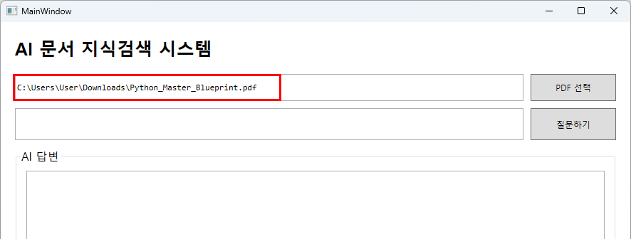
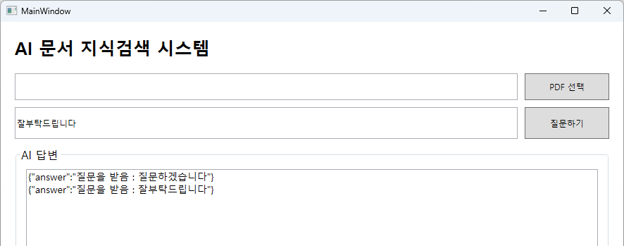
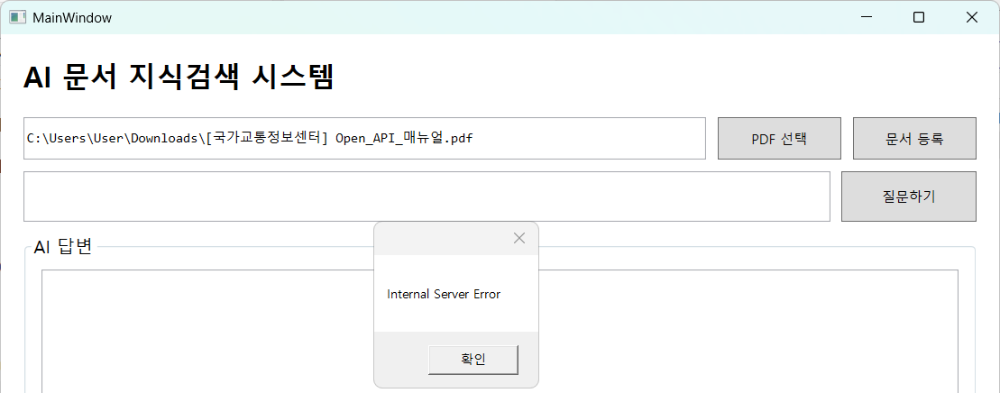

# 토이 프로젝트 7

## AI 문서검색·질의응답 시스템

### 개요


기업 문서를 기반으로 한 AI 지식검색 시스템 개발

- 사내 PDF 문서 등록해 두고, 사용자가 자연어로 질문을 하면 관련 문서를 찾아서 근거와 함께 답변을 해주는 WPF 윈앱 프로그램을 구현

사용기술

| 구분 | 기술 |
|---|---|
| 화면 | C# WPF |
| 서버 | Python FastAPI |
| PDF 처리 | Python |
| 벡터 DB | ? |
| AI 모델 | Ollama 또는 OpenAI |
| 통신 | REST API / JSON |
| DB 저장 | ? |

#### RAG

Retrieval Augmented Generation : 검색(Retrieval) + AI 답변생성(Generation)

내가 제공한 문서를 먼저 검색한 뒤 그 내용을 참고해서 답변하는 방식. [구글 노트북](https://notebook.google.com)이 대표적인 사이트

### 프로젝트 구성

```plaintext
Toyprojects07(AIKnowledgeSystem)
│
├─ Client(WPF Client) - 사용자 화면
│
└─ Server(Ai Server) - FastAPI + Python Functions
```

#### 클라이언트 구현

##### Visual Studio WPF 프로젝트 생성

WPF 애플리케이션 프로젝트 생성. .NET 10.0 (LTS) 선택

##### MainWindow.xaml 디자인


##### 파일선택 구현



##### 서버로 데이터 전송



##### 문서등록버튼 추가


##### PDF 전송 기능



- 파일명에 공백 있으면 업로드 실패
- 동일명의 파일이 올라가면 이전 파일 삭제, 새로 업로드


#### 서버 구현

##### 필요 패키지 설치

- 가상환경에 FastAPI용 패키지 설치

    ```powershell
    > pip install fastapi uvicorn
    ```

##### FastAPI 서버 구현

- 기본 서버 구현

    ```python
    from fastapi import FastAPI

    app = FastAPI()

    @app.get('/')
    def index():
        return {
            'message' : 'AI Knowledge Server'
        }

    @app.get('/health')
    def health():
        return {
            'status' : 'OK'
        }
    ```

- 실행

    ```powershell
    > uvicorn main:app --reload
    ```

- Swagger UI에서 확인 [http://localhost:8000/docs](http://localhost:8000/docs)

    

##### 질문받기 Post API 추가

```python
from pydantic import BaseModel  # API로 전달할 기본 모델

# json과 dictionary로 쉽게 처리하기 위해서
# 속성값을 규칙에 맞게 할당받기 위해서
class QuestionRequest(BaseModel):
    question: str

@app.post('/ask')
def ask(request: QuestionRequest):
    return {
        'answer' : f'질문을 받음 : {request.question}'
    }
```

##### 파일 업로드 Post 기능 추가

```powershell
> pip install python-multipart
```

```python
from fastapi import FastAPI, UploadFile, File
import os
import shutil

UPLOAD_DIR = 'uploads'
os.makedirs(UPLOAD_DIR, exist_ok=True)

@app.post('/upload')
async def upload(file: UploadFile = File(...)):
    save_path = os.path.join(UPLOAD_DIR, file.filename)

    with open(save_path, 'wb') as buffer:
        shutil.copyfileobj(file.file, buffer)

    return {
        'message' : '업로드 완료',
        'filename' : 'file.filename'
    }
```
